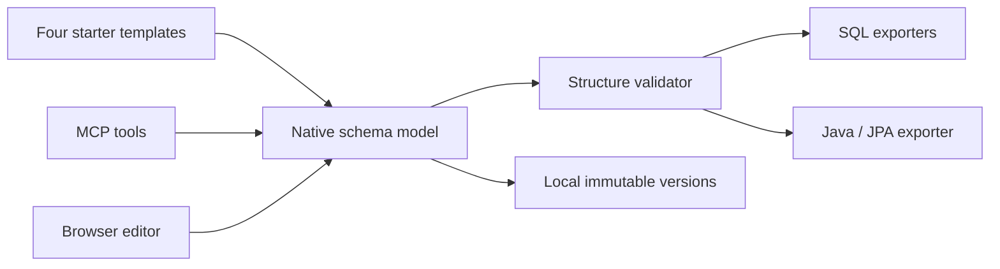

# Independent implementation

The first prototype modified an existing AGPL editor. The user then selected a new implementation to reduce dependency on that original application's code. This public repository contains a separately written product based on functional requirements. The earlier application is not bundled, imported or relicensed.

- `core.py` and `starters.py` are deterministic standard-library code without file, network or database access.
- `store.py` saves native JSON by content hash under topic/project folders. Values used as filenames are normalized and hashed. Version IDs are opaque content hashes; caller paths are never accepted by MCP or HTTP.
- `mcp_server.py` exposes eight explicit stdio tools through the separately installed official SDK. Only `save_project` writes local data. No remote publishing tool or stored server credentials are included.
- `web.py` serves original HTML/CSS/JavaScript on loopback. It validates Host, Origin, body size and a per-process request token. The browser has no third-party assets, analytics, automatic Star calls or schema transmission to outside servers.
- `web/` edits the native model, displays validation, previews source files and handles explicit save/download. No npm build is needed.

Native files identify themselves as `channelshift.schema/v1`. They are not legacy drawDB exports. The model has logical entity/attribute definitions rather than embedded editor coordinates or frontend component state. Database exporters map the same model independently; adding a language or DB does not require rewriting the UI. SQL and Java generators do not execute their output.

Persistence and remote transport are separate concerns. The old installed application's authorized SSH synchronization remains outside this independent release. Nothing reads its keys, automatically migrates its records, or reuses its browser profile. Remote synchronization for this native format is future work.

The new code is MIT. The SDK and its transitive dependencies keep their own licenses, including mixed licenses within pywin32. `docs/dependency-inventory.json` and `THIRD_PARTY_NOTICES.md` describe the checked distribution. This implementation boundary is an engineering record, not a legal opinion or a claim that all third-party copyright has disappeared.
