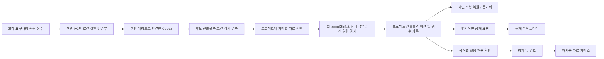

# ChannelShift 회원 플랫폼 설계 초안

상태: 요구사항 정리. 2026-09-29. 아래 기능은 v0.1.0에 구현되어 있지 않다.

사용자가 확정한 중심 흐름은 **클라이언트 요구사항 원문의 자연어 접수 → 프로그램에서 본인 Codex 로그인 → 본인의 구독 한도 안에서 홈페이지 제작·검수·납품**이다. S0 고객 원문 접수 → S0B 프로젝트·환경 점검 → S1 정식 요구사항 순서를 따른다. 공개 회원 플랫폼은 프로젝트 소유권과 선택한 산출물·검수·납품 기록을 담는다. 실제 회원 자료를 공용 템플릿이나 AI 개선에 재사용하는 목적·범위는 별도 결정 사항으로 남아 있다.

## 설계 문서와 예시

- [홈페이지 납품 공정](DELIVERY_PIPELINE.md): 요구사항 이후 시스템 설계와 디자인 검토를 병행하고, 세 계약의 정합성 검수를 거쳐 구현·검수·배포·인계로 이어지는 순서와 완료 증거.
- [본인 Codex 연결](CODEX_CONNECTION.md): 로컬 실행 연결부와 본인 계정, 구독 한도·인증·중단·재개의 경계.
- [백엔드 설계 보조](BACKEND_ASSISTANT.md): 기존 프로젝트 파악 → 기본 설계 제안 → 사용자 조정 → 코드·마이그레이션·검사 → 수동 수정 보존.
- [원장과 검증 증거](LEDGER_EVIDENCE.md): 설계·코드 출처를 연결하고, 실제 업무 사건의 무결성과 원천 대사는 필요 시 별도 후속 범위로 추가.
- [예약 프로젝트 설정 예시](examples/booking-blueprint.json) 및 [사용 범위](examples/README.md): 세부 조정의 JSON 계약 초안. 첫 납품 프로필을 예약 서비스로 정한 것이 아니다.

이 문서들은 구현을 위한 명세다. 개발 브랜치의 [로컬 접수 파일럿](INTAKE_PILOT.md)은 기존 Codex 구독 로그인으로 후보 작성, Jev 보조 판단, 사람 개입 사유 저장까지 구현했다. 회원가입·전체 백엔드 생성·승인 강제 서버의 완성을 뜻하지 않는다.

## 제품 목표

신입직원이 고객 원문을 접수하면 다음 작업과 검수 기준을 안내받고 실제 홈페이지와 인계자료를 완성하도록 돕는다. 회사 소개·포트폴리오·문의 접수·관리자 로그인·문의 관리 프로필은 정식 요구사항과의 적합성을 확인한 뒤 선택할 파일럿 후보이며 원문을 템플릿에 강제로 맞추지 않는다. 실제 고객 원문이 없는 현재는 합성 입력으로 검사할 수 있지만 고객 프로젝트 제작을 시작했다고 간주하지 않는다. 로컬 파일럿 후 누구나 가입할 수 있는 개인·팀 작업공간으로 확장하며 공개 가입 방향을 유지한다.

ChannelShift 회원 신원과 직원 본인의 Codex 계정 연결은 별개다. 로컬 데스크톱·동반 프로그램이 본인 Codex 구독으로 생성·수정 작업을 실행하고, 클라우드 서비스는 허용한 산출물과 진행 기록을 동기화하도록 설계한다. 계정 공동 사용·구독 풀·무승인 API 과금 전환을 제공하지 않는다. 현재 구현은 단일 OS 사용자의 접수 후보 작성 연결이며 회원 인증·프로그램 내부 로그인 UI·클라우드 동기화는 후속 범위다.

‘작업 저장’의 범위는 **사용자가 해당 클라우드 프로젝트에 저장하기로 선택한 요구사항·화면·DB 설계·코드·검수 증거와 버전 이력**이다. 키 입력·화면·PC 전체 파일·다른 프로그램의 작업은 수집하지 않는다. 실제 운영 DB 레코드, 고객 개인정보 원문, 비밀번호·토큰·Codex 인증 저장소는 일반 산출물 저장에서 제외한다. 현재 로컬 작업을 자동으로 업로드하거나 기존 사용자에게 클라우드 저장을 소급 적용하지 않는다.

고객 요청 원문은 허용된 저장 위치의 SRC 버전으로 보존하고 요구사항의 `source_refs`로 연결한다. 필요한 가림 처리는 파생본으로 남기며, 업무상 보존 기간에는 원문을 덮어쓰지 않는다. 이는 삭제·보존 정책에 따른 만료나 적법한 삭제까지 금지한다는 뜻이 아니다. 내부 제안은 고객 확인 전 고객 필수 요구사항으로 승격하지 않는다. 납품 전 원문 항목의 채택·질문·확인된 제외 등 처리 상태를 검토하며 의미상 누락 없음이 자동 증명된다고 표시하지 않는다.

개인 작업은 다른 회원에게 비공개이며 공개 공유·공용 템플릿·AI 개선은 각각 별도 권한으로 관리한다. 필요 시 추가하는 업무 원장 단계에서만 연결별 목적·원천·필드·기간·보존 정책을 지정하고 승인된 자료를 다룬다. 실제 업무 원문은 회원이 통제하는 저장소에 두며 회원 자료 축적·공개·교차 회원 AI 학습과 자동으로 연결하지 않는다. 자세한 수집·대사 경계는 원장 문서를 따른다.

회원 자료를 서비스에 저장하는 권한과 공개·재사용할 권한은 구분한다. 계정 생성만으로 회원의 작업에 대한 모든 권리가 운영자에게 넘어간다고 가정하지 않는다. 가입과 클라우드 작업 시작 화면에서 저장 대상과 사용 목적을 설명한다.

## 저장과 활용의 경계

| 영역 | 보관 내용 | 접근 및 이동 조건 |
| --- | --- | --- |
| 개인 작업공간 | 선택한 고객 요청·요구사항·화면·DB 설계·코드·검수 증거, 프로젝트 분류·버전 | 소유자와 명시적으로 초대한 구성원; 비밀·실제 고객 개인정보·운영자료 제외 |
| 운영 기록 | 오류 코드, 요청 결과, 사용량, 권한 변경 | 업무상 필요한 운영 역할; 설계 원문·비밀 값은 로그에서 제외 |
| 공개 라이브러리 | 사용자가 공개한 특정 설계 버전 | 공개 동작과 표시할 작성자 정보 확인 |
| 재사용 후보 자료 | 별도 활용에 동의한 특정 설계 버전 | 목적별 허용 기록과 원본 추적 정보 확인 후 제한된 처리자 접근 |

공개 게시와 템플릿 재사용과 AI 활용은 서로 다른 목적이다. 하나의 선택을 나머지 허용으로 해석하지 않는다. 이름을 지운 설계도 테이블명·필드명·기본값·업무 구조에 민감한 정보가 남을 수 있으므로 자동으로 익명 자료라고 표시하지 않는다. 정제·검토를 통과한 자료만 공용 자료로 전환한다.

원본 운영 데이터와 재사용 자료는 별도 저장 영역·접근 권한·보존 정책으로 관리한다. 원본 저장량과 재사용 가능 자료량을 다른 지표로 표시한다. 삭제·탈퇴·활용 철회 시 미처리 작업과 파생 자료를 추적할 수 있어야 하며, 이미 공개된 복사본이나 학습 결과까지 즉시 회수된다고 약속하지 않는다.

## 최소 데이터 모델

| 모델 | 책임 |
| --- | --- |
| users / external_identities | 계정과 검증된 인증 제공자의 사용자 식별자 연결 |
| workspaces / memberships | 개인·팀 경계, 소유자·편집자·열람자 역할 |
| projects | 작업공간 소유 프로젝트, 이름, 주제, 현재 버전 |
| schema_versions | 작업공간·프로젝트 소유의 불변 설계 버전, 작성자, 부모 버전, 내용 해시 |
| source_versions / requirement_source_refs | 고객 요청 원문의 SRC 버전, 요구사항과의 출처 연결, 처리 상태·보존 정책 |
| artifact_versions / delivery_records | 선택한 요구사항·화면·코드·검수 증거의 버전, 납품 공정의 후보 manifest·단계 기록 참조 |
| publications | 특정 버전의 명시적 공개 상태와 공개 표시 정보 |
| reuse_permissions | 자료·목적·고지 버전에 연결된 허용 및 철회 기록 |
| dataset_items | 정제 상태, 출처 버전, 적용 허용 기록, 처리 이력 |
| audit_events / deletion_jobs | 관리자 접근·권한 변경 이력, 삭제·보존 작업 상태 |

프로젝트 ID와 버전 ID는 별개로 둔다. 공개 API ID는 불투명한 임의 식별자를 사용하고, 내용 해시는 중복 확인용 메타데이터로만 쓴다. 동일 내용이 다른 회원에게 있어도 다른 회원 자료의 존재나 원문이 드러나지 않도록 중복 처리 범위를 프로젝트 소유 경계 안에 둔다. 해시를 알고 있다는 이유로 읽기 권한을 부여하지 않는다.

주제 폴더는 분류다. 접근 통제는 검증된 계정의 작업공간 소속과 역할로 판단한다. 모든 하위 데이터의 작업공간·프로젝트 소유 관계는 DB 제약으로 일관되게 유지한다.

## 서비스 구조

- 공개 웹서비스는 성숙한 OIDC 인증 구현을 사용한다. 제공자·계정 복구·이메일 검증 정책은 배포 환경을 확인한 후 확정한다. 자체 세션·암호 프로토콜을 새로 발명하지 않는다.
- Codex 로그인은 공식 연결 경계에서 처리한다. ChannelShift 서버가 Codex 비밀번호·인증 토큰을 보관하거나 다른 회원 작업에 계정 연결을 승계하지 않는다. 웹 화면의 실행 명령은 인증된 로컬 동반 프로그램 연결이 있어야 수행된다.
- 모든 읽기·쓰기·목록·다운로드·내보내기에 서버의 소유권 검사를 적용한다. 클라이언트가 보낸 작업공간 ID는 선택 값일 뿐 권한 증명이 아니다.
- 중앙 서비스의 DB에는 작업공간 조건, 복합 소유 관계 제약과 행 단위 정책을 적용한다. 일반 요청 역할이 정책을 우회하지 않도록 구성하고 실제 DB에서 검증한다.
- 파일·캐시·백그라운드 작업·검색·백업에도 같은 소유 경계를 전달한다. 내부 작업자라고 전체 자료에 무조건 접근시키지 않는다.
- 관리자 원문 열람은 업무 목적에 필요한 권한으로 제한하고 이력을 남긴다. 일반 운영 통계 화면에는 회원 설계 원문을 노출하지 않는다.
- 클라우드 프로젝트에서 선택한 산출물 범위에만 자동 저장을 제공한다. 저장 중·완료·오프라인 상태를 표시하고, 동시 수정에는 기준 버전을 확인해 덮어쓰기를 방지한다.
- 로컬 MCP 도구는 계속 로컬로 동작한다. 원격 저장은 로그인한 계정, 목적지, 대상 작업공간이 명확한 별도 기능으로 추가하며 도구의 외부 전송 설명과 권한 표기를 갱신한다.

## 구현 순서와 검증

1. B0 원문 접수·계획·Gate 계산을 기준으로, 본인 Codex 연결·로컬 작업 실행을 좁은 파일럿에서 검증한다. 실제 고객 원문을 접수하고 정식 요구사항을 확정한 뒤 회사 사이트 프로필의 적합성을 판단한다. 그전의 합성 예시는 기능 검사에만 사용한다. 로그인 성공과 실행 완료를 각각 확인한다.
2. 문의 접수와 관리자 조회 한 흐름을 요구사항부터 프론트까지 연결한다. 실제 격리 DB·검사 증거·독립 리뷰·필요한 승인·중단 복구를 구현하며 수동 코드를 보존한다. 이 단계의 기준은 납품 공정 B1~B6이다.
3. 로컬 납품 흐름을 확인한 뒤 공개 가입·개인 작업공간·소유권 검사·계정 복구를 구현한다. 클라우드 산출물 저장은 이 권한 경계를 통과한 사용자에게만 제공한다.
4. 선택한 산출물의 불변 버전·자동 저장·충돌 처리·내보내기·삭제와 데스크톱·MCP 연결을 구현한다. 출처·후보 manifest·검수·승인을 같은 버전에 묶고 신뢰된 기록과 모델 출력을 구분한다.
5. 파일럿 근거를 바탕으로 Backend Blueprint의 지원 프로필·세부 조정 범위를 확대한다. 현재 Java 출력 지원이 첫 완성형 홈페이지 스택 확정을 뜻하지는 않는다.
6. 실제 업무 원장 검증은 필요할 때 한 도메인·제한된 원천으로 별도 도입한다. 회원 자료 재사용도 목적 확정·허용·철회·정제를 거치는 별도 범위이며 실제 업무 원문은 자동 포함하지 않는다.

로컬 파일럿에서는 본인 계정 로그인·한도 대기·안전한 재개, 문의 저장·관리자 조회·상태 유지, 이전 후보의 검수 재사용 거부와 Writer 중복 실행 차단을 확인한다. 이 검증이 끝나도 공개 회원 격리 검증을 생략하지 않는다.
필수 검증은 A 회원이 B 회원의 프로젝트·목록·버전·파일에 접근할 수 없는지, 같은 설계 해시를 알아도 경계를 넘지 못하는지, 권한 철회 후 세션·백그라운드 작업·다운로드가 차단되는지, 자동 저장 충돌이 자료를 잃지 않는지, 활용 허용 철회가 후보 선정과 대기 작업에서 반영되는지다. 운영 역할의 우회 경로와 백업 복구 후 격리도 검증한다.

## 아직 확정하지 않은 결정

- 회원 작업의 활용 목적: 보관·동기화 / 공개 공유 / 공용 템플릿 / AI 개선. 사용자에게 범위를 질문한 상태이며, 목적이 확정되기 전 재사용 수집은 켜지 않는다.
- 보관 기간, 삭제 유예와 백업 만료, 공개 자료의 이용 조건, 활용 철회의 적용 범위.
- 인증 제공자, 공개 서비스 배포 환경과 계정·프로젝트별 용량 제한.

## 근거

- [OWASP Multi-Tenant Security](https://cheatsheetseries.owasp.org/cheatsheets/Multi_Tenant_Security_Cheat_Sheet.html): 검증된 사용자와 소속으로 작업공간 문맥을 확정하고 저장소·작업자·캐시 전반에 경계를 적용한다.
- [OWASP User Privacy Protection](https://cheatsheetseries.owasp.org/cheatsheets/User_Privacy_Protection_Cheat_Sheet.html): 수집·처리 과정의 투명성과 개인정보 보호 원칙을 참고한다.
