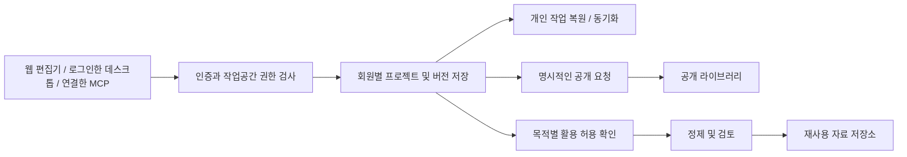

# ChannelShift 회원 플랫폼 설계 초안

상태: 요구사항 정리. 2026-09-29. 아래 기능은 v0.1.0에 구현되어 있지 않다.

사용자가 확정한 방향은 공개 회원 플랫폼, 기존 프로젝트에 맞춘 백엔드 설계 보조, 선언적인 세부 조정, 설계·코드 출처와 실제 업무 원장 검증의 단계적 지원이다. 실제 회원 자료를 공용 템플릿이나 AI 개선에 재사용하는 목적·범위는 별도 결정 사항으로 남아 있다.

## 설계 문서와 예시

- [백엔드 설계 보조](BACKEND_ASSISTANT.md): 기존 프로젝트 파악 → 기본 설계 제안 → 사용자 조정 → 코드·마이그레이션·검사 → 수동 수정 보존.
- [원장과 검증 증거](LEDGER_EVIDENCE.md): 설계·코드 출처를 먼저 연결하고, 실제 업무 사건의 무결성과 원천 대사를 다음 단계로 추가.
- [예약 프로젝트 설정 예시](examples/booking-blueprint.json) 및 [사용 범위](examples/README.md): 기본 프로필 위에 패키지명·API 경로·페이지 크기·트랜잭션 설정을 명시적으로 조정하는 JSON 계약 초안.

이 문서들은 구현을 위한 명세이며 회원가입 서버, 백엔드 생성 엔진, 원장 검증 서비스가 완성됐다는 의미가 아니다.

## 제품 목표

블로그 서비스처럼 누구나 가입해 개인 작업공간에서 DB 구조를 설계하고, 서비스가 그 설계와 수정 이력을 보관하는 플랫폼으로 확장한다. 개인 작업은 다른 회원에게 비공개로 두며, 공개 공유와 공용 템플릿·AI 개선을 위한 재사용은 별도의 권한으로 관리한다. 이전의 초대 전용 가입 제안은 공개 가입 방향으로 대체한다.

‘모든 작업’의 초기 제안 범위는 **사용자가 클라우드 작업공간에서 작성하고 저장한 DB 구조와 버전 이력**이다. 키 입력·화면·PC 파일·다른 프로그램의 작업은 수집하지 않는다. 일반 설계 저장에서는 실제 DB 레코드, 고객 데이터, 접속 비밀번호와 토큰도 대상에서 제외한다. 현재 로컬 작업을 자동으로 업로드하거나 기존 사용자에게 클라우드 저장을 소급 적용하지 않는다.

후속 업무 원장 단계에서만 연결별 목적·원천·필드·기간·보존 정책을 지정하고 승인된 자료를 다룬다. 실제 업무 원문은 회원이 통제하는 저장소에 두며, 회원 자료 축적·공개·교차 회원 AI 학습과 자동으로 연결하지 않는다. 자세한 수집·대사 경계는 원장 문서를 따른다.

회원 자료를 서비스에 저장하는 권한과 공개·재사용할 권한은 구분한다. 계정 생성만으로 회원의 작업에 대한 모든 권리가 운영자에게 넘어간다고 가정하지 않는다. 가입과 클라우드 작업 시작 화면에서 저장 대상과 사용 목적을 설명한다.

## 저장과 활용의 경계

| 영역 | 보관 내용 | 접근 및 이동 조건 |
| --- | --- | --- |
| 개인 작업공간 | 설계, 프로젝트 분류, 저장 버전 | 소유자와 명시적으로 초대한 구성원 |
| 운영 기록 | 오류 코드, 요청 결과, 사용량, 권한 변경 | 업무상 필요한 운영 역할; 설계 원문·비밀 값은 로그에서 제외 |
| 공개 라이브러리 | 사용자가 공개한 특정 설계 버전 | 공개 동작과 표시할 작성자 정보 확인 |
| 재사용 후보 자료 | 별도 활용에 동의한 특정 설계 버전 | 목적별 허용 기록과 원본 추적 정보 확인 후 제한된 처리자 접근 |

공개 게시와 템플릿 재사용과 AI 활용은 서로 다른 목적이다. 하나의 선택을 나머지 허용으로 해석하지 않는다. 이름을 지운 설계도 테이블명·필드명·기본값·업무 구조에 민감한 정보가 남을 수 있으므로 자동으로 익명 자료라고 표시하지 않는다. 정제·검토를 통과한 자료만 공용 자료로 전환한다.

원본 운영 데이터와 재사용 자료는 별도 저장 영역·접근 권한·보존 정책으로 관리한다. 원본 저장량과 재사용 가능 자료량을 다른 지표로 표시한다. 삭제·탈퇴·활용 철회 시 미처리 작업과 파생 자료를 추적할 수 있어야 하며, 이미 공개된 복사본이나 학습 결과까지 즉시 회수된다고 약속하지 않는다.

## 최소 데이터 모델

| 모델 | 책임 |
| --- | --- |
| users / external_identities | 계정과 검증된 인증 제공자의 사용자 식별자 연결 |
| workspaces / memberships | 개인·팀 경계, 소유자·편집자·열람자 역할 |
| projects | 작업공간 소유 프로젝트, 이름, 주제, 현재 버전 |
| schema_versions | 작업공간·프로젝트 소유의 불변 설계 버전, 작성자, 부모 버전, 내용 해시 |
| publications | 특정 버전의 명시적 공개 상태와 공개 표시 정보 |
| reuse_permissions | 자료·목적·고지 버전에 연결된 허용 및 철회 기록 |
| dataset_items | 정제 상태, 출처 버전, 적용 허용 기록, 처리 이력 |
| audit_events / deletion_jobs | 관리자 접근·권한 변경 이력, 삭제·보존 작업 상태 |

프로젝트 ID와 버전 ID는 별개로 둔다. 공개 API ID는 불투명한 임의 식별자를 사용하고, 내용 해시는 중복 확인용 메타데이터로만 쓴다. 동일 내용이 다른 회원에게 있어도 다른 회원 자료의 존재나 원문이 드러나지 않도록 중복 처리 범위를 프로젝트 소유 경계 안에 둔다. 해시를 알고 있다는 이유로 읽기 권한을 부여하지 않는다.

주제 폴더는 분류다. 접근 통제는 검증된 계정의 작업공간 소속과 역할로 판단한다. 모든 하위 데이터의 작업공간·프로젝트 소유 관계는 DB 제약으로 일관되게 유지한다.

## 서비스 구조

- 공개 웹서비스는 성숙한 OIDC 인증 구현을 사용한다. 제공자·계정 복구·이메일 검증 정책은 배포 환경을 확인한 후 확정한다. 자체 세션·암호 프로토콜을 새로 발명하지 않는다.
- 모든 읽기·쓰기·목록·다운로드·내보내기에 서버의 소유권 검사를 적용한다. 클라이언트가 보낸 작업공간 ID는 선택 값일 뿐 권한 증명이 아니다.
- 중앙 서비스의 DB에는 작업공간 조건, 복합 소유 관계 제약과 행 단위 정책을 적용한다. 일반 요청 역할이 정책을 우회하지 않도록 구성하고 실제 DB에서 검증한다.
- 파일·캐시·백그라운드 작업·검색·백업에도 같은 소유 경계를 전달한다. 내부 작업자라고 전체 자료에 무조건 접근시키지 않는다.
- 관리자 원문 열람은 업무 목적에 필요한 권한으로 제한하고 이력을 남긴다. 일반 운영 통계 화면에는 회원 설계 원문을 노출하지 않는다.
- 클라우드 프로젝트에서만 자동 저장을 제공한다. 저장 중·완료·오프라인 상태를 표시하고, 동시 수정에는 기준 버전을 확인해 덮어쓰기를 방지한다.
- 로컬 MCP 도구는 계속 로컬로 동작한다. 원격 저장은 로그인한 계정, 목적지, 대상 작업공간이 명확한 별도 기능으로 추가하며 도구의 외부 전송 설명과 권한 표기를 갱신한다.

## 구현 순서와 검증

1. 공개 가입·로그인·개인 작업공간·소유권 검사와 계정 복구를 구현한다.
2. 클라우드 프로젝트, 불변 버전, 자동 저장, 충돌 처리, 내보내기·삭제와 같은 권한 체계의 데스크톱·MCP 연결을 구현한다.
3. 기존 Java 프로젝트 탐색, Backend Blueprint, 기본 프로필·세부 조정, 코드 변경 제안과 테스트 증거를 연결한다. 적용 시 수동 수정은 보존한다.
4. 생성 산출물·설계 버전·프로필·검사 결과의 출처를 검증하고, 서명과 독립 신뢰 기준을 갖춘 증거를 제공한다.
5. 한 업무 도메인과 제한된 원천을 선택해 업무 사건·정정 원장, 누락·중복 탐지, 외부 원천 대사를 구현한다.
6. 회원 자료 활용 목적이 확정되면 공개 라이브러리·활용 허용·철회와 정제 절차를 거쳐 재사용 자료를 축적한다. 실제 업무 원문은 별도 사용 허용 없이 포함하지 않는다.

필수 검증은 A 회원이 B 회원의 프로젝트·목록·버전·파일에 접근할 수 없는지, 같은 설계 해시를 알아도 경계를 넘지 못하는지, 권한 철회 후 세션·백그라운드 작업·다운로드가 차단되는지, 자동 저장 충돌이 자료를 잃지 않는지, 활용 허용 철회가 후보 선정과 대기 작업에서 반영되는지다. 운영 역할의 우회 경로와 백업 복구 후 격리도 검증한다.

## 아직 확정하지 않은 결정

- 회원 작업의 활용 목적: 보관·동기화 / 공개 공유 / 공용 템플릿 / AI 개선. 사용자에게 범위를 질문한 상태이며, 목적이 확정되기 전 재사용 수집은 켜지 않는다.
- 보관 기간, 삭제 유예와 백업 만료, 공개 자료의 이용 조건, 활용 철회의 적용 범위.
- 인증 제공자, 공개 서비스 배포 환경과 계정·프로젝트별 용량 제한.

## 근거

- [OWASP Multi-Tenant Security](https://cheatsheetseries.owasp.org/cheatsheets/Multi_Tenant_Security_Cheat_Sheet.html): 검증된 사용자와 소속으로 작업공간 문맥을 확정하고 저장소·작업자·캐시 전반에 경계를 적용한다.
- [OWASP User Privacy Protection](https://cheatsheetseries.owasp.org/cheatsheets/User_Privacy_Protection_Cheat_Sheet.html): 수집·처리 과정의 투명성과 개인정보 보호 원칙을 참고한다.
